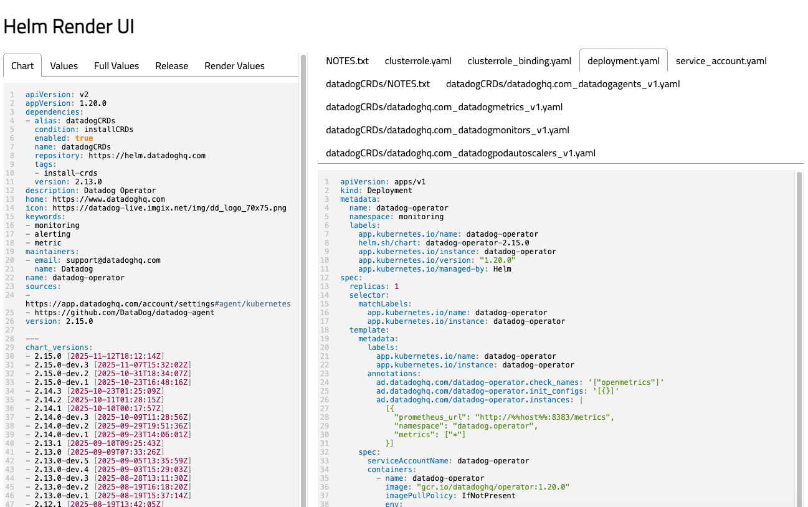

# helm-render-ui

`helm-render-ui` is a command-line tool to preview rendered Helm templates in a local webview.

Features:
* load from a local chart path, or a remote Helm repository URL.
* can set one or more value files using `-f`.
* opens a webpage in a local HTTP server.
* downloads dependencies automatically.

## Install

Get an executable from the [releases](https://github.com/rrgmc/helm-render-ui/releases) page, or if you have a 
Go 1.25 compiler available:

```shell
go install github.com/rrgmc/helm-render-ui@latest
```

## Screenshots

```shell
$ helm-render-ui --repo https://helm.datadoghq.com datadog-operator -n monitoring -f environments/dev.yaml
```



## Author

Rangel Reale (rangelreale@gmail.com)

Layout was based on [https://github.com/mzjp2/helm-template-preview](https://github.com/mzjp2/helm-template-preview).